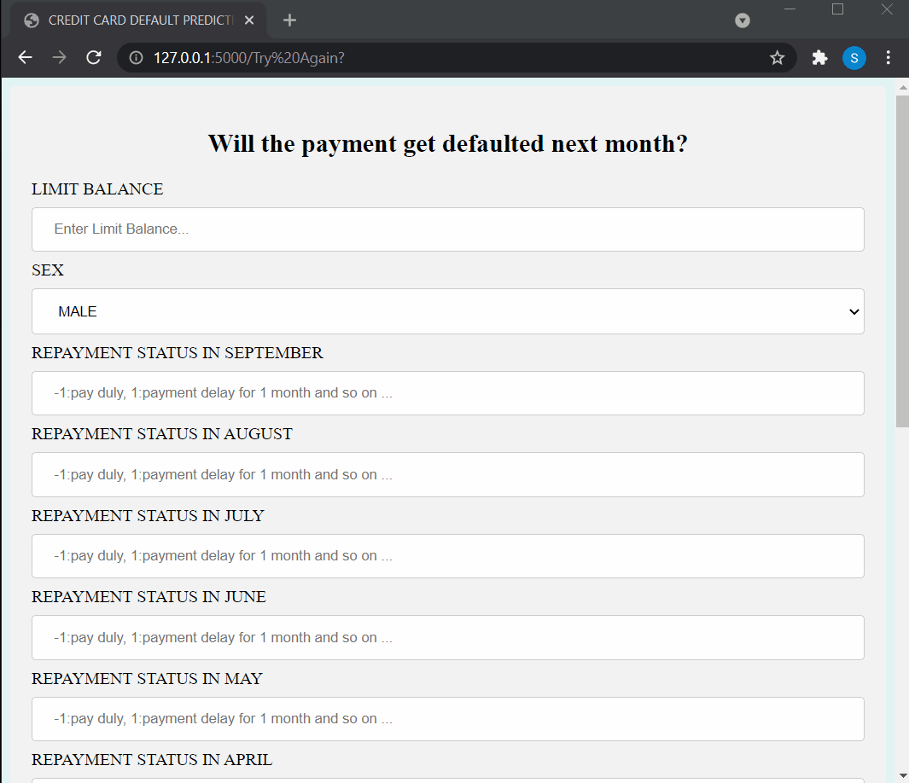

# Credit-Card-Default-Prediction

This project predicts whether there will be a default in payments or not for the next month based on parameters.

## Demo
Link: https://creditdefaultprediction-api.herokuapp.com/



## Installation

I have built this whole project using Python version 3.8.10. So, My advice is to install Python if you did not, and if you are using a lower version, upgrade it using the pip package. Lastly, After cloning the repositories, install the required packages and libraries from the following command.

```bash
  pip install -r requirements.txt
```
## Deployement

This project is deployed on Heroku. First, you need to create your account on Heroku, then connect to yout Github Account and click on deploy manually.

[](https://www.heroku.com/home)


## Directory Tree

```bash
├── static 
│   ├── styles.css
├── template
│   ├── home.html
│   ├── result.html
├── Credit_Card_code.ipynb
├── Credit_default.gif
├── Procfile
├── README.md
├── SC.pkl
├── UCI_Credit_Card.csv
├── app.py
├── model3.pkl
├── requirements.txt

```
  
## Technologies used


[](https://flask.palletsprojects.com/en/2.0.x/)
[](https://gunicorn.org/)
[](https://scikit-learn.org/stable/)


## About Pickle Files

